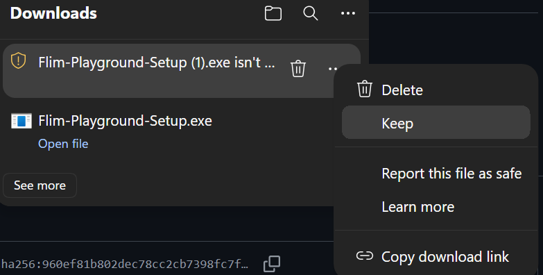
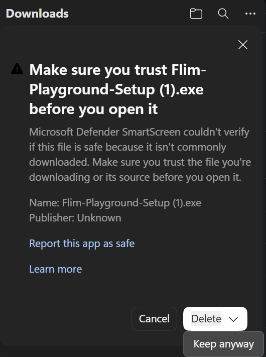
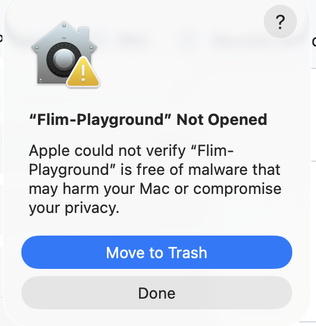
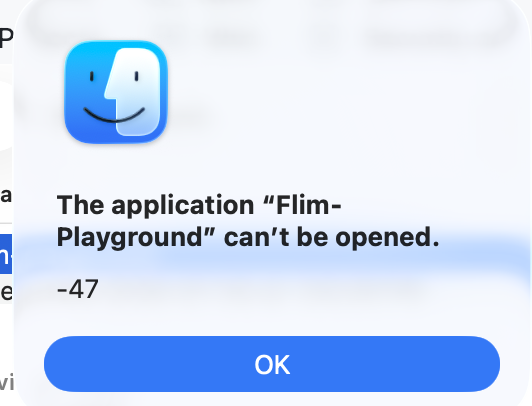

# FLIM Playground

<p align="center">
  
</p>

<p align="center">
  <a href="https://doi.org/10.5281/zenodo.19744706"></a>
</p>

FLIM Playground allows you to extract single-cell features from <span title="can be readily extended to other imaging modalities">fluorescence lifetime imaging microscopy (FLIM)</span>[^1] raw data (**Data Extraction**) and analyze extracted features or your own datasets using a built-in repertoire of visual-analytic modules (**Data Analysis**).

[^1]: can be readily extended to other imaging modalities

## 🎡 Playground Construction News

- 📊 **Feature Histogram category panels** — **Separate by** and **Color by** compare individual-unit distributions in stacked rows with shared scales and colors. Count curves and GMM fits use each category’s own observations to explore variability and distribution heterogeneity. Python export reproduces the complete figure and category-qualified GMM labels.
- 🔬 **2D Feature Distribution category views** — Use **Separate by** to switch between full-size joint distributions with consistent axes and colors. Marginals, correlations, regression, GMM results, and counts follow the selected category. The four encoding controls are **Separate by**, **Color by**, **Collapse by**, and one **Opacity | Shape** picker. Collapse averages complete X/Y observations within each category, color group, and replicate; exports reproduce the same analysis.
- 🧭 **Phasor category views** — Choose one **Separate by** category, then switch its values directly below the encoding controls in one full-size plot. Other categories remain visible as faint gray context points. Colors stay consistent, while counts and optional K-Means overlays follow the selected category. Python and CSV exports retain the separation.
- 🗺️ **Dimension Reduction separation grid** — Keep a combined UMAP, PCA, or t-SNE overview beside smaller maps highlighting individual groups. **Separate by** accepts two categorical columns: the first defines rows and the second defines columns. Color, shape, and opacity remain independent, and the Python export reproduces the whole composition in one SVG.
- 🎨 **Point encoding in one row** — In *Feature Comparison*, use **Opacity | Subcolor | Shape** to choose how one categorical column decorates the points. Switching modes takes one click and keeps the selected column; clearing the column turns that encoding off. Subcolor assigns consistent colours across groups and changes *Color by* to *Group by*. The four controls are *Separate by*, *Color/Group by*, *Collapse by*, and the shared point encoding. *2D Feature Distribution* offers the same layout with **Opacity | Shape**; Phasor Plot and Dimension Reduction keep separate shape and opacity controls. Missing data (`N/A`) stays outside the opacity ramp so it can never outrank a real level.
- ⚡ **Speed & scale** — Point plots switch to WebGL rendering above 5,000 drawn points, so large figures no longer freeze the page on scroll; styling tweaks restyle the existing figure instead of rebuilding it, and the KDE overlay is no longer quadratic in point count. In *Data Extraction*, lifetime curve fitting runs across CPU cores via multiprocessing, and raw-data checks are keyed on the files they actually read, so reassigning one channel no longer re-decodes every later channel's files.
- 🎯 **"Except:" selections** — Every categorical filter and feature picker takes an *Except:* mode, so keeping all-but-a-few is one click instead of many. Filters also narrow symmetrically against each other, so the order of columns in your config no longer decides which filter combinations are reachable.
- 🧪 **Derived feature extraction & analysis** — Build custom mathematical features (e.g., redox ratios like `A / (A + B)`, or ratio / difference formulas) using arithmetic expressions over existing features. These are appended as `Derived: <name>` columns and automatically consolidated into a unified **Derived Features** group in the Data Analysis layer.
- 🗂️ **Multiple configuration profiles** — Save up to 10 named setups in *Data Extraction* (channels, file suffixes, feature extractors, fixed lifetimes, laser rate, …) and switch between them in one click from the Configuration page. *Data Analysis* configurations are profile-based too, so you can keep several datasets' settings side by side.
- 📜 **Export Data Analysis as a Python script** — Download a standalone, editable Python script that reproduces all *Data Analysis* settings you see in FLIM Playground; also saves figures as publication-ready SVG.

# Data Extraction Demo
- Demo uses the T cell activation [dataset](example_data/Data_Extraction/T_cell_activation) from this [paper](https://pmc.ncbi.nlm.nih.gov/articles/PMC11425855/):

https://github.com/user-attachments/assets/a01b8a22-1bc3-46f1-aa37-1c3191a6fa1a

# Data Analysis Demo
- Demo uses the inhibitor treatments on cancer cell lines (MCF7 and PANC-1) [dataset](./example_data/Data_Analysis/inhibitors.csv) extracted by Data Extraction:

https://github.com/user-attachments/assets/7ac6b61f-7bde-45b8-92f5-5dbdb05dde67

## Show cells and replicate means in Feature Comparison

Use the existing controls to build a **SuperPlot**:

| Control | Example selection |
| --- | --- |
| Separate by | None, or a category for separate comparison sections |
| Color / Group by | Treatment |
| Collapse by | Dish |
| Point encoding | Subcolor, with Dish selected |
| Overlay | SuperPlot |

**Collapse by** produces the main points: one arithmetic mean per dish within
each comparison group and section. **SuperPlot** adds the original filtered
observations as smaller, fainter points underneath, plus a horizontal mean bar
and capped SEM error bars across the dish means. Every dish has equal weight,
regardless of its number of cells. With one dish, its mean remains visible and
the unavailable SEM is explained.

Subcolor only controls appearance; selecting Dish gives its cells and mean the
same color. Statistical tests, effect sizes, Connect means, and legend counts
continue to describe the collapsed points. The original cell dots never increase
the statistical sample size. The existing independent and Welch's tests remain
available; matching colors do not select a paired test.

**Overlay** replaces Add boxplot with None, Boxplot, and SuperPlot. None shows
only the main points; Boxplot summarizes those points. SuperPlot is available
when Collapse by is selected, and clearing Collapse by switches it off. Existing
boxplot settings are retained. Point Size adjusts both layers while keeping
original observations smaller.

Log Y averages cells before transforming the replicate means; original cells
are transformed individually for display. A negative original value prevents
the log transform for both SuperPlot layers. Python exports reproduce the
observations, replicate means, summary bars, and statistics in one SVG.

## Compare groups in Dimension Reduction

Choose **Separate by** after selecting your features and reduction method:

| Selection | Display |
| --- | --- |
| None | One combined overview |
| One categorical column | Overview beside one vertical column of small maps, one per value |
| Two categorical columns | Overview beside a matrix, with the first selection defining rows and the second defining columns |

UMAP, PCA, and t-SNE use consistent plotting frames that are wider than they are
tall. Coordinate ranges are padded to preserve equal x/y scales without
stretching the embedding. The chart fits the available screen height.
Every panel uses the same embedding, coordinate ranges, and aspect ratio. The
overview and the complete grid align at their top and bottom edges, including
when resizing the chart or opening it in fullscreen. Zooming or panning one
panel updates the others. Small maps highlight matching observations and show the
remaining observations in gray as context. Black bottom and left axis lines
separate the panels; gridlines remain hidden.
Small-map points are two units smaller than overview points (minimum size 1),
and their row and column labels follow **Legend Font Size**.
The right margin fits the labels, and the legend has its own space below the
overview's x-axis title.
Empty matrix intersections retain their panel. Values follow natural order, and
missing categories appear as `N/A`.

**Color by**, **Shape by**, and **Opacity by** can reuse separation columns. Each
Color by combination retains its own palette color across all panels. The shared
legend controls foreground points throughout the figure. **Show group counts**
reports unique observations in the shared legend. Gray context and repeated
displays do not inflate those counts.

Filtering and removal of incomplete feature observations happen before fitting.
Changing separation or visual encodings reuses the
cached coordinates. Separation settings survive method changes and column review;
a selected separation column remains selected when filtering leaves one value.
The standalone Python export includes these settings and saves the full view as
one SVG. This separation grid is available in Dimension Reduction.

## Compare groups in Phasor Plot

Choose one categorical column in **Separate by**, then use the category buttons
directly below the encoding row to switch between its values in one full-size Phasor view. More
than six values use a dropdown. Values follow natural order; missing categories
appear as `N/A`. Clearing Separate by restores the combined plot. The selection
survives method changes and filtering to one remaining value.

The separation column cannot also be used for **Color by**. Colors, shapes, and
opacity mappings stay consistent when switching categories, with fixed G/S axes
and the same lifetime references. Other categories always remain faint gray for
context. Color-group counts in the right-hand legend and clustering overlays
describe the selected category. The selector identifies the current category.

When enabled, K-Means fits each **separation value × color group** independently,
using the selected cluster count. Groups with too few distinct G/S observations
remain visible and report why clustering was skipped. Cluster numbers belong to
their own fit; the CSV qualifies them with their category, for example
`day=Day 1 | ctrl_group1`. Switching categories changes visibility without
refitting. The Python export reproduces the current category with gray context
and a category label beneath the plot in one SVG. It can save one combined CSV containing all retained observations
and their independently fitted cluster labels.

This differs from Dimension Reduction, where separation highlights subsets of
one globally fitted embedding, and Feature Comparison, where separation creates
sections and comparisons within each section.

## Compare groups in 2D Feature Distribution

Choose one categorical column in **Separate by**, then switch its values using the
buttons below the encoding row (a dropdown appears above six values). Each view
retains the full-size square scatter and both marginal distributions. X and Y keep
their own units and share consistent ranges across categories. Colors, shapes, and
opacity mappings also stay consistent. Other categories appear as faint gray
scatter context and contribute nothing to the current view's fits or counts.

Pearson r, regression, marginal distributions, and optional 2D GMM are calculated
within each **separation value × Color by group**. Shape and opacity only style the
points. The shared **Opacity | Shape** picker applies one decoration at a time;
switching modes retains its column and clearing it turns the decoration off.

**Collapse by** produces one mean point per **replicate × separation value × color
group**. Only cells with both X and Y contribute to the means and hover counts.
Log transforms apply after averaging. All models and marginals then describe those
replicate points. Decorations that vary within a collapsed point are disabled with
a notice. Groups that are too small or constant keep their points and explain
which analyses are unavailable. Filtering to one replicate retains an active
Collapse by selection.

Categories follow natural order, including `N/A` for missing values. Separation
and category settings survive method changes and column review. Category switches
reuse prepared results; clearing Separate by restores the combined analysis.
The Python export reproduces the selected category and gray context in one SVG.
The GMM CSV retains all analyzed categories, including collapsed rows when enabled,
and qualifies component labels by category because component numbers belong to
their own fit.

## Feature Histogram distributions

Feature Histogram explores variability and distribution heterogeneity among
individual units, such as cells or ROIs. Each retained row contributes one observation.

**Separate by · Color by** control grouping and layout.
Separate by creates one full-width row per category, in natural order, including
`N/A` for missing categories. All rows remain visible with normal page scrolling;
clearing separation combines the data. Histogram separation settings survive method
changes, column review, and filtering to one category. Separate by excludes its
column from Color by.

Count curves share one set of bins calculated from all retained observations.
Both count and GMM density modes share X ranges, zero-based Y ranges, and colors
across rows, with aligned panels and only the bottom X axis displayed.
Each **separation value × color group** has its own counts, skewness,
GMM fit, component table, thresholds, and H-index. Each panel has a compact legend
at its upper right. GMM legends sit outside the axes so they do not cover the
curves. Numeric skewness appears only in count-histogram legends. When **Show group
counts (n) in legend** is enabled, legends include the local number of individual
units. Panel titles show only the category value and use the same theme color as
the axes. GMM details appear in category expanders beneath the figure.

Filters apply first, then rows with missing selected-feature values are removed.
Log X, when enabled, applies once to each remaining observation before binning and
model fitting. Raw and Log X views remember their own bin widths; small widths
display enough significant digits to avoid rounding to zero. Counts and GMM fits
describe these individual units throughout.

Sparse and constant groups keep their observations and counts. Skewness is reported
as undefined when there are fewer than three observations or no variation. GMM
requires at least two distinct observations; unavailable fits produce local notices.
Single-component fits keep their density curve and leave subpopulation labels
unassigned. Component ranks always follow ascending means within each fit. If
intersection thresholding fails, that group uses the highest posterior probability.

The Python export reproduces every panel in one SVG using the same numerical
preparation as the app. The GMM CSV retains individual rows from all analyzed
categories. Labels such as `day=Day 2 | ctrl_group1` identify the
local fit; `group1` is its lowest-mean component, not a shared component across days.

## Use Your Own Data in Data Analysis
- Demo uses the [iris dataset](example_data/Data_Analysis/iris.csv) and the [wine quality dataset](example_data/Data_Analysis/wine_quality.csv):
  
https://github.com/user-attachments/assets/08b55f51-c7a6-4fa3-a00a-65f3fcd11cc6

# Quick try 
It is deployed at: [https://flim-playground.streamlit.app/](https://flim-playground.streamlit.app/). 
You can try out analysis modules in the **Data Analysis** section using this sample [dataset](./example_data/Data_Analysis/inhibitors.csv) extracted previously by the **Data Extraction** module.

# Install
## Option 1: Download from Releases
Grab the latest build for your OS under the **Releases** tab on the right (available for macOS, Windows 11, and Ubuntu 24.04 LTS):
- **macOS** — download `Flim-Playground-mac.tar.gz` (Apple Silicon: M1 and later) or `Flim-Playground-mac-intel.tar.gz` (Intel Macs — check **Apple menu → About This Mac** if unsure), unzip, run the [one-line Terminal command below](#first-launch-getting-past-the-security-warning) once, then double-click **Flim-Playground.app**.
- **Windows** — download `Flim-Playground-Setup.exe`, run the installer, then launch from the **Start Menu** shortcut it creates.
- **Linux** (Ubuntu 24.04+) — download `Flim-Playground-linux.tar.gz` and **double-click it to extract** (or right-click → *Extract* in your file manager). You get a single **`Flim-Playground-linux`** folder — open it and run `./install.sh` once to add **FLIM Playground** to your application menu, then click it to launch. (Or run the `Flim-Playground` binary directly.) *Prefer the terminal? Extract with `tar --one-top-level -xzf Flim-Playground-linux.tar.gz` so the files land in their own folder instead of the current directory.*

### First launch: getting past the security warning
FLIM Playground is distributed **without a paid code-signing certificate**, so the first time you open a downloaded build, Windows and macOS show a security warning. This is expected for open-source apps shipped outside the App Store / Microsoft Store — nothing is wrong with the download, and you can always [build from source](#option-2-build-from-source) if you'd rather verify it yourself. You only need to clear the warning **once per download**.

**Windows** — Microsoft Defender SmartScreen flags the installer because it "isn't commonly downloaded" yet:

- **In your browser:** if the download is flagged, click **⋯ → Keep**, then **Keep anyway** when it double-checks.

   

- **When you run it:** double-click `Flim-Playground-Setup.exe`; if a blue *"Windows protected your PC"* box appears, click **More info → Run anyway**, then proceed through the installer.

**macOS** — the app isn't notarized by Apple, so **before double-clicking it for the first time**, open **Terminal** (find it with Spotlight: ⌘-Space, type "Terminal"), paste this one line, and press Return:

```bash
xattr -dr com.apple.quarantine ~/Downloads/Flim-Playground.app
```

This strips the download-quarantine flag, so the app opens with a normal double-click and you skip macOS's security pop-ups entirely. If the app is somewhere other than Downloads (e.g. `/Applications`), point the command at that path instead.

**Prefer a single step?** macOS only sets the quarantine flag on files downloaded by a *browser* — `curl` does not set it at all. Download that way and there is nothing to strip and no warning to clear. Instead of downloading from the Releases tab, paste the two lines for your Mac into Terminal (unsure which? **Apple menu → About This Mac**):

**Apple Silicon** (M1 and later):

```bash
curl -fL -o ~/Downloads/Flim-Playground-mac.tar.gz \
  https://github.com/skalalab/flim_playground/releases/latest/download/Flim-Playground-mac.tar.gz &&
  tar -xzf ~/Downloads/Flim-Playground-mac.tar.gz -C ~/Downloads
```

**Intel Macs:**

```bash
curl -fL -o ~/Downloads/Flim-Playground-mac-intel.tar.gz \
  https://github.com/skalalab/flim_playground/releases/latest/download/Flim-Playground-mac-intel.tar.gz &&
  tar -xzf ~/Downloads/Flim-Playground-mac-intel.tar.gz -C ~/Downloads
```

Either way you get **Flim-Playground.app** in your Downloads folder — just double-click it. No `xattr`, no pop-ups.

If you double-clicked first and got blocked with one of the errors below — no problem: run the same command, then double-click again.

 

### Upgrading
Already running an older version? Grab the latest build from the **Releases** tab, then follow the steps for your platform below. Because every download is a fresh, unsigned file, the [security warning](#first-launch-getting-past-the-security-warning) above **reappears for each new version** — clear it the same way each time (on macOS, re-run the `xattr` command on the new download — or use the `curl` upgrade command below, which never triggers the warning in the first place). Your settings — `config.toml` (Data Extraction) and `analysis_config.toml` (Data Analysis, if you have one) — are **not** bundled inside the app, so they carry over. Where they are stored, and what that means when you upgrade, differs by platform:

- **macOS** — the whole upgrade is one paste into **Terminal**, which downloads the new build, removes the old app and unpacks the new one in its place. The three steps are chained (`&&`) and `curl` is asked to fail on an HTTP error (`-f`), so a download that does not arrive leaves the app you already have untouched. Use the block for your Mac (unsure which? **Apple menu → About This Mac**); if you keep the app somewhere other than Downloads, adjust all three paths.

  **Apple Silicon** (M1 and later):

  ```bash
  curl -fL -o ~/Downloads/Flim-Playground-mac.tar.gz \
    https://github.com/skalalab/flim_playground/releases/latest/download/Flim-Playground-mac.tar.gz &&
    rm -rf ~/Downloads/Flim-Playground.app &&
    tar -xzf ~/Downloads/Flim-Playground-mac.tar.gz -C ~/Downloads
  ```

  **Intel Macs:**

  ```bash
  curl -fL -o ~/Downloads/Flim-Playground-mac-intel.tar.gz \
    https://github.com/skalalab/flim_playground/releases/latest/download/Flim-Playground-mac-intel.tar.gz &&
    rm -rf ~/Downloads/Flim-Playground.app &&
    tar -xzf ~/Downloads/Flim-Playground-mac-intel.tar.gz -C ~/Downloads
  ```

  Because `curl` never sets the download-quarantine flag, **there is no `xattr` step and no security warning** — just double-click the new app. Prefer the browser? Download the tarball from the Releases tab as before, delete the old **Flim-Playground.app**, extract the new one in its place, then re-run the [`xattr` command](#first-launch-getting-past-the-security-warning) on it. Either way your settings are saved in the folder *beside* the app, **outside** the `.app` bundle, so swapping the app never touches them — just keep the two `.toml` files where they are.
- **Windows** — run the new `Flim-Playground-Setup.exe`; it upgrades your existing installation in place. Your settings sit at the **root of the install folder** (next to the program, not inside the internal payload the installer refreshes), so they are preserved automatically.
- **Linux** — your settings are saved in `~/.config/flim-playground/` (following the XDG convention), **outside** the app folder, so replacing the app never touches them. Delete the old `Flim-Playground-linux` folder, double-click the new tarball to extract it in the same place, then re-run `./install.sh` so the menu launcher points at the new files — your settings are picked up automatically.

## Option 2: Build from source
### Clone the repo
```bash
git clone https://github.com/skalalab/flim_playground.git
```
Then Navigate into the repository once cloned. 

### Install the python environment
- Install `uv` if not yet installed
- run `uv sync`
- then run `source .venv/bin/activate` to activate the virtual environment (works in Mac OS, Linux distributions, and Windows Git bash)

### Build
```bash
pyinstaller Flim-Playground.spec --clean
```
This produces a ready-to-run app folder (`dist/Flim-Playground/`, or `Flim-Playground.app` on macOS) you can launch directly. The Windows `Setup.exe` installer is built separately by CI (Inno Setup), so a from-source build on Windows gives you the runnable app folder rather than an installer.

# Documentation
- @[docs](https://skalalab.github.io/flim_playground_doc/)

# Citation

If FLIM Playground contributed to your research — whether through **Data Extraction** for single-cell feature extraction or through **Data Analysis** for data exploration, visualization, selection of analysis methods, or hyperparameter tuning (UMAP, clustering, classification, etc.) — please cite **both** the software version you used and the preprint. Your citation directly supports us in maintaining and improving it ✨🎈🍾.

**Publication:**
> Zhao, W., Samimi, K., Skala, M.C., and Datta, R. (2026). FLIM Playground: An interactive, end-to-end graphical user interface for analyzing single cells with fluorescence lifetime imaging microscopy. Cell Rep. Methods. https://doi.org/10.1016/j.crmeth.2026.101484

**Software: the latest version**
> Zhao W., Samimi K., Skala M.C., Datta R. *FLIM Playground* [Computer software]. Zenodo. https://doi.org/10.5281/zenodo.19744706

**Raw data used in the paper:**
> Zhao, W., Samimi, K., Skala, M. C., & Datta, R. (2026). *Example and validation datasets for FLIM Playground* [Data set]. Zenodo. https://doi.org/10.5281/zenodo.19774943

# TODO

- [] add hierarchical clustering
- [] add linear mixed effect model
- [] add modality alignment
- [] phasor draw gates to filter
- [] add confidence interval to effect size

# Useful Commands
```bash
streamlit run main.py # when in development
```

```bash
python launcher.py # check for building 
```
