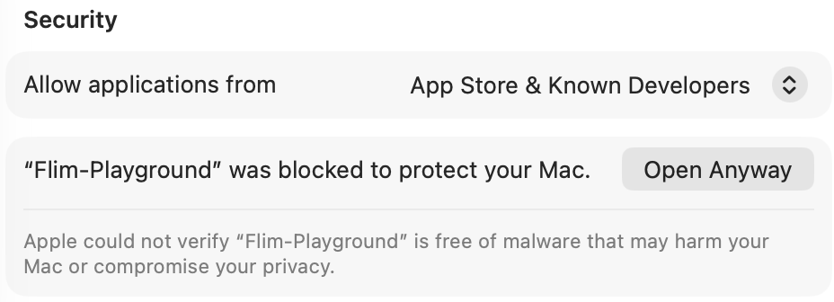

# FLIM Playground

<p align="center">
  
</p>

<p align="center">
  <a href="https://doi.org/10.5281/zenodo.19744706"></a>
</p>

FLIM Playground allows you to extract single-cell features from fluorescence lifetime imaging microscopy (FLIM) raw data (**Data Extraction**) and analyze extracted features or your own datasets using a built-in repertoire of visual-analytic modules (**Data Analysis**).

## 🎡 Playground Construction News Center 

- 🧪 **Derived feature extraction & analysis** — Build custom mathematical features (e.g., redox ratios like `A / (A + B)`, or ratio / difference formulas) using arithmetic expressions over existing features. These are appended as `Derived: <name>` columns and automatically consolidated into a unified **Derived Features** group in the Data Analysis layer.
- 🗂️ **Multiple configuration profiles** — Save up to 10 named setups in *Data Extraction* (channels, file suffixes, feature extractors, fixed lifetimes, laser rate, …) and switch between them in one click from the Configuration page. *Data Analysis* configurations are profile-based too, so you can keep several datasets' settings side by side.
- 📜 **Export Data Analysis as a Python script** — Download a standalone, editable Python script that reproduces all *Data Analysis* settings you see in FLIM Playground; also saves figures as publication-ready SVG.
- 🚀 **Parallel curve fitting** — Lifetime curve fitting in *Data Extraction* runs across CPU cores via multiprocessing, so large batches finish much faster than sequential fitting.

# Data Extraction Demo
- Demo uses the T cell activation [dataset](example_data/Data_Extraction/T_cell_activation) from this [paper](https://pmc.ncbi.nlm.nih.gov/articles/PMC11425855/):

https://github.com/user-attachments/assets/a01b8a22-1bc3-46f1-aa37-1c3191a6fa1a

# Data Analysis Demo
- Demo uses the inhibitor treatments on cancer cell lines (MCF7 and PANC-1) [dataset](./example_data/Data_Analysis/inhibitors.csv) extracted by Data Extraction:

https://github.com/user-attachments/assets/7ac6b61f-7bde-45b8-92f5-5dbdb05dde67

## Use Your Own Data in Data Analysis
- Demo uses the [iris dataset](example_data/Data_Analysis/iris.csv) and the [wine quality dataset](example_data/Data_Analysis/wine_quality.csv):
  
https://github.com/user-attachments/assets/08b55f51-c7a6-4fa3-a00a-65f3fcd11cc6

# Quick try 
It is deployed at: [https://flim-playground.streamlit.app/](https://flim-playground.streamlit.app/). 
You can try out analysis modules in the **Data Analysis** section using this sample [dataset](./example_data/Data_Analysis/inhibitors.csv) extracted previously by the **Data Extraction** module.

# Install
## Option 1: Download from Releases
Grab the latest build for your OS under the **Releases** tab on the right (available for macOS, Windows 11, and Ubuntu 24.04 LTS):
- **macOS** — download `Flim-Playground-mac.tar.gz`, unzip, and double-click **Flim-Playground.app**.
- **Windows** — download `Flim-Playground-Setup.exe`, run the installer, then launch from the **Start Menu** shortcut it creates.
- **Linux** (Ubuntu 24.04+) — download `Flim-Playground-linux.tar.gz` and **double-click it to extract** (or right-click → *Extract* in your file manager). You get a single **`Flim-Playground-linux`** folder — open it and run `./install.sh` once to add **FLIM Playground** to your application menu, then click it to launch. (Or run the `Flim-Playground` binary directly.) *Prefer the terminal? Extract with `tar --one-top-level -xzf Flim-Playground-linux.tar.gz` so the files land in their own folder instead of the current directory.*

### First launch: getting past the security warning
FLIM Playground is distributed **without a paid code-signing certificate**, so the first time you open a downloaded build, Windows and macOS show a security warning. This is expected for open-source apps shipped outside the App Store / Microsoft Store — nothing is wrong with the download, and you can always [build from source](#option-2-build-from-source) if you'd rather verify it yourself. You only need to clear the warning **once per download**.

**Windows** — Microsoft Defender SmartScreen flags the installer because it "isn't commonly downloaded" yet:

- **In your browser:** if the download is flagged, click **⋯ → Keep**, then **Keep anyway** when it double-checks.

   

- **When you run it:** double-click `Flim-Playground-Setup.exe`; if a blue *"Windows protected your PC"* box appears, click **More info → Run anyway**, then proceed through the installer.

**macOS** — Gatekeeper blocks the app because Apple hasn't notarized it. Depending on your macOS version you'll hit one of two blocks:

- **"Apple could not verify…" (Not Opened)** — this softer block *can* be cleared in the UI: open **System Settings → Privacy & Security**, scroll to **Security**, click **Open Anyway** next to *"Flim-Playground" was blocked*, then confirm.

   

- **`-47` "can't be opened"** — on recent macOS the block appears as this error instead. It has **no *Open Anyway* button and cannot be cleared through System Settings** — the Terminal command below is the only fix.

  

**Terminal fix** — works for both cases, and is the **only** way past the `-47` error. Strip the download-quarantine flag, then open:

```bash
xattr -dr com.apple.quarantine ~/Downloads/Flim-Playground.app
open ~/Downloads/Flim-Playground.app
```

If you moved the app elsewhere (e.g. `/Applications`), point the command at that path instead.

### Upgrading
Already running an older version? Grab the latest build from the **Releases** tab, then follow the steps for your platform below. Because every download is a fresh, unsigned file, the [security warning](#first-launch-getting-past-the-security-warning) above **reappears for each new version** — clear it the same way each time (on macOS, re-run the `xattr` command on the new download; if you get the `-47` error, that command is the only fix). Your settings — `config.toml` (Data Extraction) and `analysis_config.toml` (Data Analysis, if you have one) — are **not** bundled inside the app, so they carry over. Where they are stored, and what that means when you upgrade, differs by platform:

- **macOS** — extract the new `Flim-Playground-mac.tar.gz` and replace the old **Flim-Playground.app** with the new one. Your settings are saved in the folder *beside* the app, **outside** the `.app` bundle, so swapping the app never touches them — just keep the two `.toml` files where they are.
- **Windows** — run the new `Flim-Playground-Setup.exe`; it upgrades your existing installation in place. Your settings sit at the **root of the install folder** (next to the program, not inside the internal payload the installer refreshes), so they are preserved automatically.
- **Linux** — your settings are saved in `~/.config/flim-playground/` (following the XDG convention), **outside** the app folder, so replacing the app never touches them. Delete the old `Flim-Playground-linux` folder, double-click the new tarball to extract it in the same place, then re-run `./install.sh` so the menu launcher points at the new files — your settings are picked up automatically.

## Option 2: Build from source
### Clone the repo
```bash
git clone https://github.com/skalalab/flim_playground.git
```
Then Navigate into the repository once cloned. 

### Install the python environment
- Install `uv` if not yet installed
- run `uv sync`
- then run `source .venv/bin/activate` to activate the virtual environment (works in Mac OS, Linux distributions, and Windows Git bash)

### Build
```bash
pyinstaller Flim-Playground.spec --clean
```
This produces a ready-to-run app folder (`dist/Flim-Playground/`, or `Flim-Playground.app` on macOS) you can launch directly. The Windows `Setup.exe` installer is built separately by CI (Inno Setup), so a from-source build on Windows gives you the runnable app folder rather than an installer.

# Documentation
- @[docs](https://skalalab.github.io/flim_playground_doc/)

# Citation

If FLIM Playground contributed to your research — whether through **Data Extraction** for single-cell feature extraction or through **Data Analysis** for data exploration, visualization, selection of analysis methods, or hyperparameter tuning (UMAP, clustering, classification, etc.) — please cite **both** the software version you used and the preprint. Your citation directly supports us in maintaining and improving it ✨🎈🍾.

**Publication:**
> Zhao, W., Samimi, K., Skala, M.C., and Datta, R. (2026). FLIM Playground: An interactive, end-to-end graphical user interface for analyzing single cells with fluorescence lifetime imaging microscopy. Cell Rep. Methods. https://doi.org/10.1016/j.crmeth.2026.101484

**Software: the latest version**
> Zhao W., Samimi K., Skala M.C., Datta R. *FLIM Playground* [Computer software]. Zenodo. https://doi.org/10.5281/zenodo.19744706

**Raw data used in the paper:**
> Zhao, W., Samimi, K., Skala, M. C., & Datta, R. (2026). *Example and validation datasets for FLIM Playground* [Data set]. Zenodo. https://doi.org/10.5281/zenodo.19774943

# TODO

- [] add hierarchical clustering
- [] add linear mixed effect model
- [] add modality alignment
- [] phasor draw gates to filter
- [] add confidence interval to effect size

# Useful Commands
```bash
streamlit run main.py # when in development
```

```bash
python launcher.py # check for building 
```
